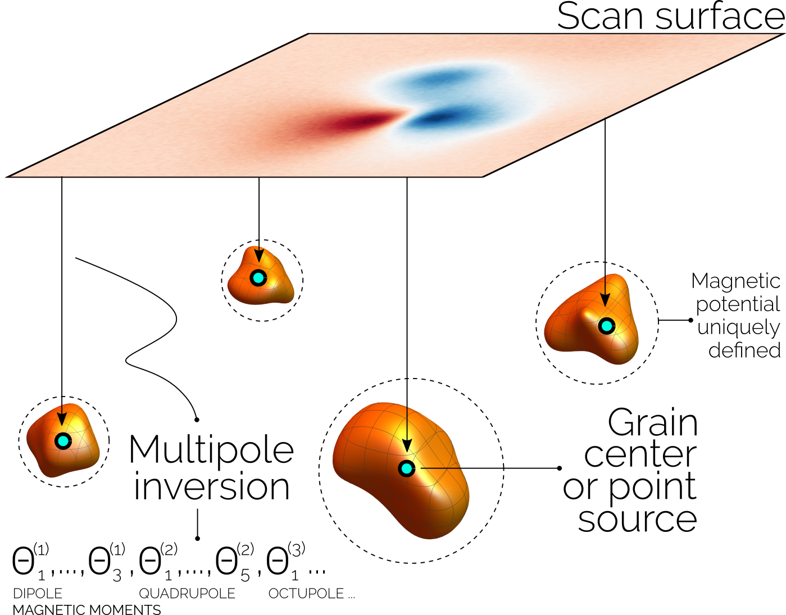

[](https://doi.org/10.5281/zenodo.6473257)
[](LICENSE)
[](https://mmt-multipole-inversion.readthedocs.io/en/latest/?badge=latest)

# MMT Numerical Libraries: Multipole Inversion



---

Library for the numerical inversion of a scan grid detecting the magnetic
signal from magnetic sources using a multipole expansion of the magnetic
potential of the sources. The mathematical background of this method and its
application to experimental data of a synthetic sample is developed in

D. Cortés-Ortuño, K. Fabian, L. V. de Groot
[Single Particle Multipole Expansions From Micromagnetic Tomography](https://agupubs.onlinelibrary.wiley.com/doi/abs/10.1029/2021GC009663)
Geochemistry, Geophysics, Geosystems **22(4)**, e2021GC009663 (2021)
DOI: [https://doi.org/10.1029/2021GC009663](https://doi.org/10.1029/2021GC009663)

This library is developed as part of the [Mimatom / MMT](https://mimatom.org/)
project.

# Library

This library has two main modules

- `multipole_inversion/magnetic_sample.py` : contains the `MagneticSample`
  class to create a magnetic system with magnetic point sources (dipole or
  higher order multipole sources) and generate the scan signal. This class also
  has methods to save the scan signal data in `npz` format and the scan grid
  specifications in `json` format.

- `multipole_inversion/multipole_inversion.py` : contains the
  `MultipoleInversion` class to perform a numerical inversion from a scan
  signal data. This class requires scan surface specifications, particle (point
  source) locations and the scan signal data. These can be passed from the
  `MagneticSample` output or be specified manually (useful for combining with
  other workflows such as micromagnetic simulations).

An additional module to plot results from the inversions is provided in
`multipole_inversion/plot_tools.py`. Magnetic susceptibility and magnetic field
functions can be found in the main library as well, although not all of them
are documented in the tutorial yet.

# Installation

Via PyPI or from this repository using `pip .` or `poetry install` or `poetry
build` (which can be used with `pip`). Poetry is recommended for development.

## CUDA

This library contains an optional Nvidia CUDA library to populate the forward
matrix in the `multipole_inversion` code. To build this library you need to set
the `CUDAHOME` or `CUDA_PATH` environment variables to the location of CUDA in
your system. Alternatively, the `nvcc` compiler path can be set in the `PATH`
variable. The it is only necessary to install or build the library using
`poetry install` or `poetry build`.

# Tutorial

For now you can visualize the Jupyter notebooks from the `jupytext` scripts in
the `doc/tutorial/` folder. These notebooks can also be generated from their
associated `jupytext` script, for example,

```
jupytext --to notebook multipoles_inversion_test.py 
```

The documentation of the classes can be generated using `sphinx` and the
scripts to do this are located in the `doc` folder. Future releases of this
library will include an online documentation of this code.

# Cite

If you find this library useful please cite us (you might need LaTeX's
`url` package)

    @Misc{Cortes2022,
      author       = {Cortés-Ortuño, David and Fabian, Karl and de Groot, Lennart V.},
      title        = {{MMT Numerical Libraries: Multipole Inversion}},
      publisher    = {Zenodo},
      note         = {Github: \url{https://github.com/Micromagnetic-Tomography/multipole_inversion}},
      year         = {2022},
      doi          = {10.5281/zenodo.6473257},
      url          = {https://doi.org/10.5281/zenodo.6473257},
    }

If you have a new version of `biblatex` you can also use `@Software` instead of 
`@Misc`, and add a `version={}` entry. You can also cite the paper with the
theoretical framework of this library:


    @article{Cortes2021,
    author = {Cortés-Ortuño, David and Fabian, Karl and de Groot, Lennart V.},
    title = {Single Particle Multipole Expansions From Micromagnetic Tomography},
    journal = {Geochemistry, Geophysics, Geosystems},
    volume = {22},
    number = {4},
    pages = {e2021GC009663},
    keywords = {magnetism, micromagnetic tomography, multipole, paleomagnetism, rock magnetism},
    doi = {https://doi.org/10.1029/2021GC009663},
    url = {https://agupubs.onlinelibrary.wiley.com/doi/abs/10.1029/2021GC009663},
    eprint = {https://agupubs.onlinelibrary.wiley.com/doi/pdf/10.1029/2021GC009663},
    note = {e2021GC009663 2021GC009663},
    year = {2021}
    }
