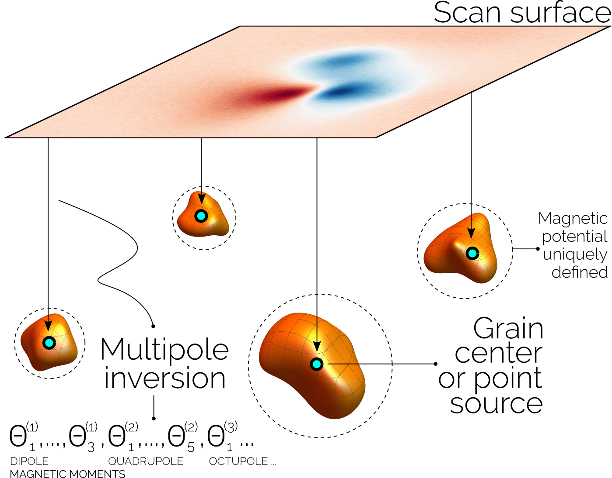

.. Multipole Inversion documentation master file, created by
   sphinx-quickstart on Fri Nov  5 16:01:58 2021.
   You can adapt this file completely to your liking, but it should at least
   contain the root `toctree` directive.

Multipole Inversion documentation
=================================

----

The **Multipole Inversion** Python library is a tool to perform numerical
inversions of magnetic scan signal on a surface into one or multiple magnetic
sources, which are modelled as physical point sources. Numerical inversions are
based on a spherical harmonic expansion of the magnetic scalar potential of
every source, from which dipole and higher order multipole moments can be
obtained. For mathematical details of the multipole inversion technique please
refer to:

| D. Cortés-Ortuño, K. Fabian, L. V. de Groot
| `Single Particle Multipole Expansions From Micromagnetic Tomography <https://agupubs.onlinelibrary.wiley.com/doi/abs/10.1029/2021GC009663>`_.
| Geochemistry, Geophysics, Geosystems **22(4)**, e2021GC009663 (2021)
| DOI: `https://doi.org/10.1029/2021GC009663 <https://doi.org/10.1029/2021GC009663>`

If you find this library useful, please cite it referring to the paper as::

    @article{https://doi.org/10.1029/2021GC009663,
    author = {Cortés-Ortuño, David and Fabian, Karl and de Groot, Lennart V.},
    title = {Single Particle Multipole Expansions From Micromagnetic Tomography},
    journal = {Geochemistry, Geophysics, Geosystems},
    volume = {22},
    number = {4},
    pages = {e2021GC009663},
    keywords = {magnetism, micromagnetic tomography, multipole, paleomagnetism, rock magnetism},
    doi = {https://doi.org/10.1029/2021GC009663},
    url = {https://agupubs.onlinelibrary.wiley.com/doi/abs/10.1029/2021GC009663},
    eprint = {https://agupubs.onlinelibrary.wiley.com/doi/pdf/10.1029/2021GC009663},
    note = {e2021GC009663 2021GC009663},
    year = {2021}
    }

Installation
------------

To install the library you can clone the Github `repository`_ and install via
`pip`

.. code-block:: sh

    git clone https://github.com/Micromagnetic-Tomography/multipole_inversion.git
    cd multipole_inversion
    pip install .

Or using the PyPI package (TO BE UPDATED):

.. code-block:: sh

    pip install multipole_inversion

.. _repository: https://github.com/Micromagnetic-Tomography/multipole_inversion

Usage
-----

Please refer to the Tutorial: Basics section.

Source code
-----------

Documentation of every function and class provides more details on the methods
and options of the library. Please refer to the following secitons for more
information:

.. toctree::
   :maxdepth: 2
   
   code/source_code

.. toctree::
   :maxdepth: 1
   :hidden:

   tutorial/tutorial_basics.ipynb

Indices and tables
==================

* :ref:`genindex`
* :ref:`modindex`
* :ref:`search`
